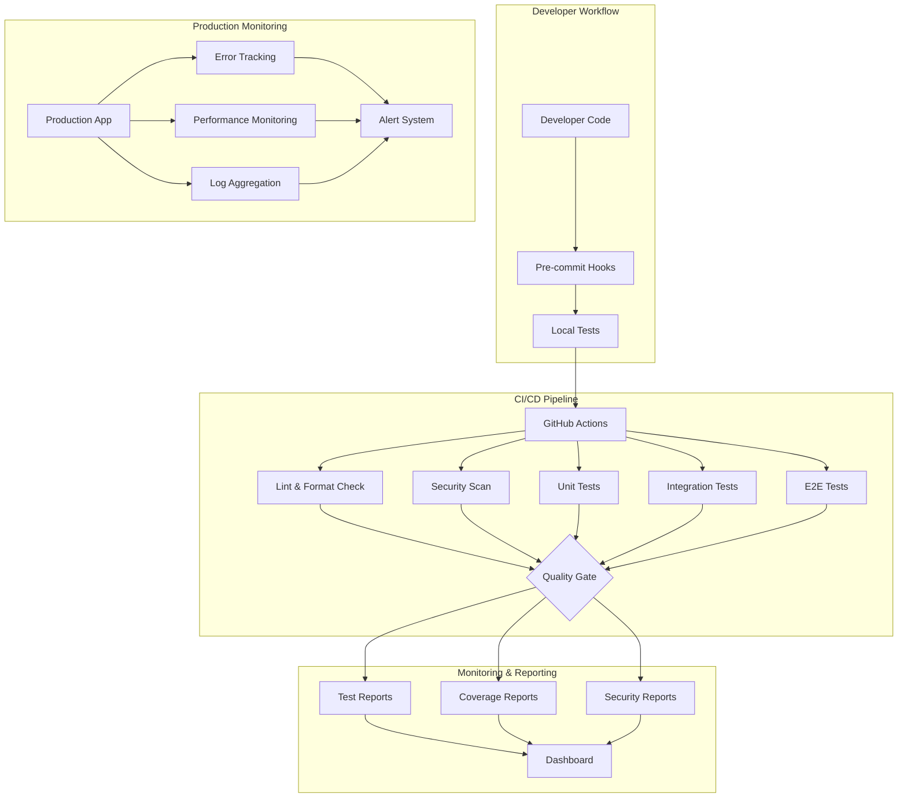
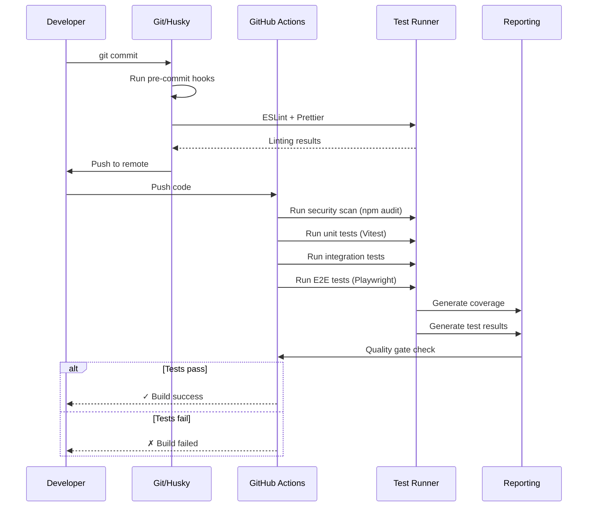

# Design Document: QA Testing Framework untuk Vaimoz LivePilot

## Overview

Sistem Quality Assurance dan Testing Framework komprehensif untuk Vaimoz LivePilot yang mencakup automated testing (unit, integration, end-to-end), code quality checks, security scanning, error monitoring, dan performance testing. Framework ini dirancang untuk mendeteksi dan mencegah semua kategori bug: security vulnerabilities, data integrity issues, API errors, frontend bugs, backend bugs, dan integration failures.

Platform ini menggunakan tech stack: React 18 + Vite (frontend), Express.js + SQLite (backend), FFmpeg untuk video streaming, dan YouTube Data API v3. Framework QA akan mengintegrasikan testing tools modern dengan CI/CD pipeline untuk automated quality gates.

## Arsitektur Testing Suite



## Main Testing Workflow



## Komponen Testing Framework

### 1. Unit Testing Layer

**Purpose**: Menguji fungsi individual, utility functions, dan business logic secara terisolasi

**Tools**:
- **Vitest**: Fast unit test runner untuk Vite projects
- **React Testing Library**: Component testing untuk React
- **Supertest**: HTTP assertion untuk API endpoints

**Coverage Targets**:
- Backend utilities: 90%+ coverage
- Frontend components: 85%+ coverage
- Business logic: 95%+ coverage

### 2. Integration Testing Layer

**Purpose**: Menguji interaksi antara komponen, database operations, API integrations

**Tools**:
- **Vitest**: Test runner
- **MSW (Mock Service Worker)**: API mocking
- **better-sqlite3**: In-memory test database

**Test Scenarios**:
- API route handlers dengan database
- FFmpeg integration dengan mock processes
- YouTube API integration dengan mock responses
- Authentication flow end-to-end

### 3. End-to-End Testing Layer

**Purpose**: Menguji complete user workflows dari UI hingga database

**Tools**:
- **Playwright**: Cross-browser E2E testing
- **Playwright Test**: Test runner dengan retry dan parallelization

**Test Scenarios**:
- User authentication flow
- Asset upload dan management
- Campaign creation dan start streaming
- Stream monitoring dan analytics
- Recurring schedule execution

### 4. Security Testing Layer

**Purpose**: Mendeteksi security vulnerabilities, dependency issues, code injection risks

**Tools**:
- **npm audit**: Dependency vulnerability scanning
- **ESLint Security Plugin**: Static code analysis untuk security issues
- **helmet**: HTTP security headers (integration)
- **OWASP Dependency Check**: Advanced vulnerability scanning

**Security Checks**:
- SQL injection prevention (parameterized queries)
- JWT token validation
- File upload security (mime-type validation, size limits)
- XSS prevention (input sanitization)
- CSRF protection
- Rate limiting pada endpoints sensitif

### 5. Performance Testing Layer

**Purpose**: Menguji performance, load handling, memory leaks

**Tools**:
- **k6**: Load testing tool
- **Lighthouse CI**: Frontend performance metrics
- **clinic.js**: Node.js performance profiling

**Performance Metrics**:
- API response time < 200ms (p95)
- Frontend First Contentful Paint < 1.5s
- Memory usage stable (no leaks)
- FFmpeg process management efficient

### 6. Code Quality Layer

**Purpose**: Enforce coding standards, best practices, consistent formatting

**Tools**:
- **ESLint**: JavaScript/JSX linting
- **Prettier**: Code formatting
- **Husky**: Git hooks untuk pre-commit checks
- **lint-staged**: Run linters hanya pada staged files

**Quality Rules**:
- No unused variables
- Consistent naming conventions
- Proper error handling (no bare catch blocks)
- No console.log in production code
- Import order consistency

### 7. Error Monitoring Layer (Production)

**Purpose**: Track errors, crashes, performance issues di production

**Tools**:
- **Sentry**: Error tracking dan crash reporting
- **Winston**: Structured logging
- **Rotating File Stream**: Log rotation management

**Monitoring**:
- Frontend JavaScript errors
- Backend unhandled exceptions
- API errors dengan request context
- FFmpeg process crashes
- Database query failures

### 8. CI/CD Integration

**Purpose**: Automated testing di setiap commit/PR

**GitHub Actions Workflow**:
1. Install dependencies
2. Run linting dan formatting checks
3. Run security audit
4. Run unit tests dengan coverage
5. Run integration tests
6. Run E2E tests
7. Generate reports
8. Quality gate: block merge jika tests fail

## Data Models untuk Testing

### Test Configuration

```typescript
interface TestConfig {
  coverage: {
    statements: number;  // 90
    branches: number;    // 85
    functions: number;   // 90
    lines: number;       // 90
  };
  timeout: {
    unit: number;        // 5000ms
    integration: number; // 15000ms
    e2e: number;         // 60000ms
  };
  retries: {
    flaky: number;       // 2
    ci: number;          // 3
  };
}
```

### Test Database Setup

```typescript
interface TestDatabaseConfig {
  type: 'in-memory' | 'file';
  path?: string;
  resetBetweenTests: boolean;
  seedData: boolean;
}
```

### Mock Data Structures

```typescript
interface MockUser {
  id: number;
  username: string;
  password_hash: string;
  display_name: string;
}

interface MockAsset {
  id: number;
  name: string;
  type: 'Video' | 'Images' | 'Thumbnail';
  path: string;
  size_bytes: number;
}

interface MockCampaign {
  id: number;
  name: string;
  mode: 'Manual RTMP' | 'YouTube API';
  status: 'Draft' | 'Aktif' | 'Scheduled';
  config_json: string;
}
```


## Core Interfaces dan Types

### Test Runner Interface

```typescript
interface TestRunner {
  name: string;
  run(testPath: string, options: TestOptions): Promise<TestResult>;
  runAll(options: TestOptions): Promise<TestResult[]>;
  watch(testPath: string): void;
}

interface TestOptions {
  coverage?: boolean;
  bail?: boolean;
  timeout?: number;
  retries?: number;
  parallel?: boolean;
  verbose?: boolean;
}

interface TestResult {
  passed: boolean;
  failed: boolean;
  skipped: boolean;
  duration: number;
  coverage?: CoverageReport;
  errors?: TestError[];
}
```

### Security Scanner Interface

```typescript
interface SecurityScanner {
  scanDependencies(): Promise<VulnerabilityReport>;
  scanCode(filePath: string): Promise<SecurityIssue[]>;
  scanEndpoints(routes: Route[]): Promise<SecurityIssue[]>;
}

interface VulnerabilityReport {
  critical: Vulnerability[];
  high: Vulnerability[];
  moderate: Vulnerability[];
  low: Vulnerability[];
  info: Vulnerability[];
}

interface SecurityIssue {
  severity: 'critical' | 'high' | 'medium' | 'low';
  type: string;
  message: string;
  file: string;
  line: number;
  recommendation: string;
}
```

### Performance Tester Interface

```typescript
interface PerformanceTester {
  loadTest(config: LoadTestConfig): Promise<LoadTestResult>;
  profileMemory(duration: number): Promise<MemoryProfile>;
  measureResponseTime(endpoint: string): Promise<ResponseMetrics>;
}

interface LoadTestConfig {
  target: string;
  duration: number;
  vus: number; // virtual users
  thresholds: {
    http_req_duration: string; // 'p(95)<200'
    http_req_failed: string;   // 'rate<0.01'
  };
}

interface LoadTestResult {
  passed: boolean;
  metrics: {
    http_reqs: number;
    http_req_duration: {
      avg: number;
      p95: number;
      p99: number;
    };
    http_req_failed: number;
  };
}
```

### Error Tracker Interface

```typescript
interface ErrorTracker {
  captureException(error: Error, context?: ErrorContext): void;
  captureMessage(message: string, level: 'info' | 'warning' | 'error'): void;
  setUser(user: User): void;
  addBreadcrumb(breadcrumb: Breadcrumb): void;
}

interface ErrorContext {
  tags?: Record<string, string>;
  extra?: Record<string, any>;
  level?: 'fatal' | 'error' | 'warning' | 'info';
  user?: User;
  request?: {
    url: string;
    method: string;
    headers: Record<string, string>;
  };
}
```


## Key Functions with Formal Specifications

### Function 1: setupTestDatabase()

```typescript
function setupTestDatabase(config: TestDatabaseConfig): Database
```

**Preconditions:**
- `config` is valid TestDatabaseConfig object
- SQLite driver (better-sqlite3) is available
- File system permissions allow database creation (if file-based)

**Postconditions:**
- Returns initialized SQLite database instance
- Database schema is created (all tables exist)
- If `seedData === true`, test data is inserted
- Database is in transaction mode for test isolation
- If `resetBetweenTests === true`, cleanup hooks are registered

**Implementation Notes:**
- Use `:memory:` untuk fast in-memory tests
- Use temporary file untuk integration tests yang butuh persistence
- Seed minimal data: 1 admin user, 2 mock assets, 1 mock campaign

### Function 2: mockFFmpegProcess()

```typescript
function mockFFmpegProcess(options: FFmpegMockOptions): MockProcess
```

**Preconditions:**
- `options.command` is valid FFmpeg command array
- `options.behavior` specifies mock behavior (success, error, timeout)

**Postconditions:**
- Returns mock child process object compatible dengan Node.js ChildProcess
- Mock process emits events sesuai behavior: 'exit', 'error', 'stdout', 'stderr'
- Mock PID is unique integer (10000 + random)
- Process can be killed dengan .kill() method

**Implementation Notes:**
- Use EventEmitter untuk simulate process events
- Delay exit event untuk simulate realistic streaming duration
- Generate mock FFmpeg output logs

### Function 3: mockYouTubeAPI()

```typescript
function mockYouTubeAPI(): MockYouTubeClient
```

**Preconditions:**
- MSW (Mock Service Worker) is initialized
- YouTube API base URL is configured

**Postconditions:**
- Returns mock YouTube client dengan methods: createBroadcast, getLiveChatId, sendChatMessage
- All API calls return realistic mock responses
- Rate limiting is simulated
- OAuth token validation is mocked

**Implementation Notes:**
- Use MSW handlers untuk intercept HTTP requests
- Return mock broadcast IDs, stream keys, watch URLs
- Simulate API errors (quota exceeded, invalid credentials)

### Function 4: assertSecureEndpoint()

```typescript
function assertSecureEndpoint(route: Route, test: SecurityTest): Promise<void>
```

**Preconditions:**
- `route` is valid Express route object
- `test` specifies security checks to perform

**Postconditions:**
- Throws AssertionError if security issue found
- Validates JWT authentication on protected routes
- Validates input sanitization
- Validates SQL injection prevention (parameterized queries)
- Validates file upload restrictions

**Implementation Notes:**
- Send malicious payloads: SQL injection strings, XSS scripts
- Verify 401 response for unauthorized requests
- Verify 400 response for invalid inputs
- Check response headers untuk security headers (helmet)


### Function 5: measureAPIPerformance()

```typescript
function measureAPIPerformance(
  endpoint: string, 
  method: HttpMethod, 
  payload?: any
): Promise<PerformanceMetrics>
```

**Preconditions:**
- `endpoint` is valid API endpoint path
- `method` is valid HTTP method (GET, POST, PATCH, DELETE)
- Server is running dan ready to accept requests

**Postconditions:**
- Returns performance metrics object
- `responseTime` is measured in milliseconds
- `memoryUsage` snapshot is captured before dan after request
- No memory leaks detected (memory returns to baseline)

**Implementation Notes:**
- Use performance.now() untuk high-resolution timing
- Capture process.memoryUsage() before dan after
- Run multiple iterations (100x) untuk average metrics
- Flag slow endpoints (>200ms p95)

### Function 6: runE2ETest()

```typescript
function runE2ETest(scenario: E2EScenario, browser: Browser): Promise<E2EResult>
```

**Preconditions:**
- `scenario` defines complete user workflow
- `browser` is initialized Playwright browser instance
- Test database is seeded dengan required data
- Backend server is running

**Postconditions:**
- Returns E2E test result dengan screenshots dan traces
- All scenario steps completed atau error captured
- Browser is closed dan resources cleaned up
- Database state is reset after test

**Implementation Notes:**
- Use Playwright page.goto(), page.click(), page.fill()
- Capture screenshots on failure
- Record video trace untuk debugging
- Validate UI state transitions
- Verify API calls made by frontend

## Algorithmic Pseudocode

### Main Testing Workflow Algorithm

```pascal
ALGORITHM runFullTestSuite()
OUTPUT: testResults of type TestSuiteResult

BEGIN
  ASSERT testEnvironmentReady() = true
  
  // Step 1: Setup
  testDb ← setupTestDatabase({ type: 'in-memory', seedData: true })
  mockServices ← initializeMockServices()
  
  // Step 2: Run test layers sequentially
  results ← []
  
  // Linting
  lintResult ← runESLint({ fix: false })
  results.append(lintResult)
  IF lintResult.errors > 0 THEN
    RETURN { passed: false, layer: 'lint', results: results }
  END IF
  
  // Security scan
  securityResult ← runSecurityScan()
  results.append(securityResult)
  IF securityResult.critical > 0 OR securityResult.high > 0 THEN
    RETURN { passed: false, layer: 'security', results: results }
  END IF
  
  // Unit tests
  unitResult ← runUnitTests({ coverage: true, parallel: true })
  results.append(unitResult)
  IF unitResult.failed > 0 OR unitResult.coverage < 85 THEN
    RETURN { passed: false, layer: 'unit', results: results }
  END IF
  
  // Integration tests
  integrationResult ← runIntegrationTests({ timeout: 15000 })
  results.append(integrationResult)
  IF integrationResult.failed > 0 THEN
    RETURN { passed: false, layer: 'integration', results: results }
  END IF
  
  // E2E tests
  e2eResult ← runE2ETests({ headless: true, retries: 2 })
  results.append(e2eResult)
  IF e2eResult.failed > 0 THEN
    RETURN { passed: false, layer: 'e2e', results: results }
  END IF
  
  // Step 3: Generate reports
  generateCoverageReport(results)
  generateSecurityReport(results)
  generateTestSummary(results)
  
  RETURN { passed: true, results: results }
END
```

**Preconditions:**
- All test dependencies installed (npm packages)
- Database file permissions correct
- FFmpeg available di system PATH
- Network access untuk YouTube API mocking

**Postconditions:**
- All test results captured dan logged
- Coverage reports generated di coverage/ directory
- Test summary printed to console
- Exit code 0 jika passed, 1 jika failed

**Loop Invariants:**
- Each test layer runs independently
- Failed layer stops execution (fail-fast)
- Results array grows monotonically


### Security Scanning Algorithm

```pascal
ALGORITHM scanForSecurityIssues(codebase)
INPUT: codebase as FileTree
OUTPUT: securityReport of type VulnerabilityReport

BEGIN
  ASSERT codebase IS NOT NULL
  
  issues ← { critical: [], high: [], moderate: [], low: [], info: [] }
  
  // Step 1: Dependency vulnerabilities
  dependencies ← readPackageJSON('package.json')
  vulns ← runNpmAudit(dependencies)
  
  FOR each vuln IN vulns DO
    issues[vuln.severity].append(vuln)
  END FOR
  
  // Step 2: Static code analysis
  sourceFiles ← findAllFiles(codebase, ['*.js', '*.jsx', '*.ts'])
  
  FOR each file IN sourceFiles DO
    // SQL Injection check
    IF containsUnsafeQuery(file) THEN
      issues.critical.append({
        type: 'SQL Injection',
        file: file.path,
        message: 'Unparameterized SQL query detected'
      })
    END IF
    
    // XSS check
    IF containsUnsafeHTML(file) THEN
      issues.high.append({
        type: 'XSS Vulnerability',
        file: file.path,
        message: 'Unsafe HTML rendering detected'
      })
    END IF
    
    // JWT validation check
    IF usesJWTWithoutValidation(file) THEN
      issues.high.append({
        type: 'Broken Authentication',
        file: file.path,
        message: 'JWT used without proper validation'
      })
    END IF
    
    // File upload check
    IF hasFileUploadWithoutValidation(file) THEN
      issues.moderate.append({
        type: 'Unrestricted File Upload',
        file: file.path,
        message: 'File upload without mime-type validation'
      })
    END IF
  END FOR
  
  // Step 3: API endpoint security
  routes ← extractAPIRoutes(codebase)
  
  FOR each route IN routes DO
    IF route.requiresAuth = false AND route.isSensitive = true THEN
      issues.critical.append({
        type: 'Broken Access Control',
        file: route.file,
        message: `Sensitive endpoint ${route.path} is not protected`
      })
    END IF
  END FOR
  
  RETURN issues
END
```

**Preconditions:**
- Codebase is accessible dan readable
- package.json exists di root directory
- npm audit command available

**Postconditions:**
- All vulnerabilities categorized by severity
- Critical issues flagged untuk immediate attention
- Report includes file locations dan remediation steps

**Loop Invariants:**
- issues object always contains all severity levels
- Each file scanned exactly once
- No duplicate vulnerability entries

### E2E Test Execution Algorithm

```pascal
ALGORITHM executeE2EScenario(scenario, browser)
INPUT: scenario of type E2EScenario, browser of type Browser
OUTPUT: result of type E2EResult

BEGIN
  ASSERT scenario.steps IS NOT NULL AND length(scenario.steps) > 0
  ASSERT browser.isConnected() = true
  
  page ← browser.newPage()
  screenshots ← []
  errors ← []
  startTime ← getCurrentTime()
  
  TRY
    FOR each step IN scenario.steps DO
      ASSERT step.action IS DEFINED
      
      // Execute step action
      CASE step.action OF
        'navigate': 
          page.goto(step.url)
        'click': 
          element ← page.locator(step.selector)
          element.click()
        'fill': 
          element ← page.locator(step.selector)
          element.fill(step.value)
        'wait': 
          page.waitForSelector(step.selector, { timeout: step.timeout })
        'assert': 
          actual ← page.locator(step.selector).textContent()
          ASSERT actual = step.expected
      END CASE
      
      // Wait for stability
      page.waitForLoadState('networkidle')
      
      // Capture screenshot after each step
      screenshot ← page.screenshot({ fullPage: true })
      screenshots.append(screenshot)
      
    END FOR
    
    duration ← getCurrentTime() - startTime
    
    RETURN {
      passed: true,
      duration: duration,
      screenshots: screenshots,
      errors: []
    }
    
  CATCH error
    // Capture failure state
    screenshot ← page.screenshot({ fullPage: true })
    screenshots.append(screenshot)
    
    errors.append({
      message: error.message,
      stack: error.stack,
      step: currentStep
    })
    
    duration ← getCurrentTime() - startTime
    
    RETURN {
      passed: false,
      duration: duration,
      screenshots: screenshots,
      errors: errors
    }
    
  FINALLY
    page.close()
  END TRY
END
```

**Preconditions:**
- Browser instance is connected dan ready
- Scenario has valid steps array
- Test server is running dan reachable
- Test database is seeded

**Postconditions:**
- Page is closed dan resources released
- All screenshots captured
- Errors contain stack traces untuk debugging
- Duration measured accurately

**Loop Invariants:**
- page object remains valid throughout execution
- screenshots array grows with each step
- Browser context remains stable


## Example Usage

### Example 1: Unit Test - API Route Handler

```typescript
import { describe, it, expect, beforeEach, afterEach } from 'vitest';
import { setupTestDatabase } from '../test/helpers/database';
import request from 'supertest';
import express from 'express';
import { authRouter } from '../services/http/auth.routes';

describe('Auth Routes', () => {
  let db;
  let app;
  
  beforeEach(() => {
    db = setupTestDatabase({ type: 'in-memory', seedData: true });
    app = express();
    app.use(express.json());
    app.use('/api/auth', authRouter);
  });
  
  afterEach(() => {
    db.close();
  });
  
  it('should login dengan valid credentials', async () => {
    const response = await request(app)
      .post('/api/auth/login')
      .send({ username: 'admin', password: 'admin123' })
      .expect(200);
    
    expect(response.body).toHaveProperty('token');
    expect(response.body).toHaveProperty('user');
    expect(response.body.user.username).toBe('admin');
  });
  
  it('should reject login dengan invalid password', async () => {
    const response = await request(app)
      .post('/api/auth/login')
      .send({ username: 'admin', password: 'wrong' })
      .expect(401);
    
    expect(response.body.error).toContain('salah');
  });
  
  it('should protect /me endpoint', async () => {
    // Without token
    await request(app)
      .get('/api/auth/me')
      .expect(401);
    
    // With valid token
    const loginRes = await request(app)
      .post('/api/auth/login')
      .send({ username: 'admin', password: 'admin123' });
    
    const response = await request(app)
      .get('/api/auth/me')
      .set('Authorization', `Bearer ${loginRes.body.token}`)
      .expect(200);
    
    expect(response.body.user.username).toBe('admin');
  });
});
```

### Example 2: Integration Test - Campaign with FFmpeg

```typescript
import { describe, it, expect, beforeEach, vi } from 'vitest';
import { setupTestDatabase } from '../test/helpers/database';
import { mockFFmpegProcess } from '../test/helpers/ffmpeg';
import request from 'supertest';
import app from '../app';

describe('Campaign Start Integration', () => {
  let db;
  let token;
  
  beforeEach(async () => {
    db = setupTestDatabase({ type: 'in-memory', seedData: true });
    
    // Login untuk get token
    const loginRes = await request(app)
      .post('/api/auth/login')
      .send({ username: 'admin', password: 'admin123' });
    token = loginRes.body.token;
    
    // Mock FFmpeg
    vi.mock('../services/ffmpegRunner', () => ({
      startFfmpegStream: mockFFmpegProcess({ behavior: 'success' })
    }));
  });
  
  it('should start campaign dengan video selection', async () => {
    // Create campaign
    const campaign = await request(app)
      .post('/api/campaigns')
      .set('Authorization', `Bearer ${token}`)
      .send({
        name: 'Test Campaign',
        mode: 'Manual RTMP',
        config: {
          rtmpUrl: 'rtmp://test.example.com/live',
          streamKey: 'test_key_123',
          videoAssetIds: [1]
        }
      })
      .expect(201);
    
    // Start campaign
    const startRes = await request(app)
      .post(`/api/campaigns/${campaign.body.campaign.id}/start`)
      .set('Authorization', `Bearer ${token}`)
      .expect(201);
    
    expect(startRes.body.ok).toBe(true);
    expect(startRes.body.streamId).toBeDefined();
    expect(startRes.body.chosenVideo).toBeDefined();
    
    // Verify stream record created
    const streams = await request(app)
      .get('/api/streams')
      .set('Authorization', `Bearer ${token}`)
      .expect(200);
    
    expect(streams.body.streams).toHaveLength(1);
    expect(streams.body.streams[0].status).toBe('Online');
  });
});
```

### Example 3: E2E Test - Complete Workflow

```typescript
import { test, expect } from '@playwright/test';

test.describe('Campaign Creation and Start', () => {
  test.beforeEach(async ({ page }) => {
    // Login
    await page.goto('http://localhost:5173');
    await page.fill('input[name="username"]', 'admin');
    await page.fill('input[name="password"]', 'admin123');
    await page.click('button:has-text("Login")');
    await page.waitForURL('**/dashboard');
  });
  
  test('should create campaign dan start stream', async ({ page }) => {
    // Navigate to campaign page
    await page.click('a:has-text("Kampanye")');
    await page.waitForURL('**/campaign');
    
    // Click new campaign
    await page.click('button:has-text("Buat Kampanye")');
    
    // Fill campaign form
    await page.fill('input[name="name"]', 'E2E Test Campaign');
    await page.selectOption('select[name="mode"]', 'Manual RTMP');
    await page.fill('input[name="rtmpUrl"]', 'rtmp://test.example.com/live');
    await page.fill('input[name="streamKey"]', 'test_key_123');
    
    // Save draft
    await page.click('button:has-text("Simpan Draft")');
    
    // Wait for success notification
    await expect(page.locator('.toast:has-text("berhasil")')).toBeVisible();
    
    // Start campaign
    await page.click('button:has-text("Mulai Live")');
    
    // Verify stream started
    await expect(page.locator('text=Status: Online')).toBeVisible({ timeout: 10000 });
    
    // Navigate to monitor page
    await page.click('a:has-text("Monitor")');
    
    // Verify stream appears in monitor
    await expect(page.locator('table tbody tr')).toHaveCount(1);
    await expect(page.locator('td:has-text("E2E Test Campaign")')).toBeVisible();
  });
});
```


### Example 4: Security Test - SQL Injection Prevention

```typescript
import { describe, it, expect } from 'vitest';
import { setupTestDatabase } from '../test/helpers/database';
import request from 'supertest';
import app from '../app';

describe('Security - SQL Injection Prevention', () => {
  it('should prevent SQL injection in login', async () => {
    // Attempt SQL injection
    const response = await request(app)
      .post('/api/auth/login')
      .send({
        username: "admin' OR '1'='1",
        password: "anything"
      })
      .expect(401);
    
    // Should fail authentication, not bypass it
    expect(response.body.error).toBeDefined();
    expect(response.body.token).toBeUndefined();
  });
  
  it('should use parameterized queries for asset search', async () => {
    const db = setupTestDatabase({ type: 'in-memory', seedData: true });
    
    // This should NOT execute arbitrary SQL
    const maliciousName = "test'; DROP TABLE assets; --";
    
    // Attempt to inject via asset name
    const token = await getAuthToken();
    await request(app)
      .post('/api/assets/upload')
      .set('Authorization', `Bearer ${token}`)
      .attach('files', Buffer.from('fake'), maliciousName);
    
    // Verify table still exists
    const result = db.prepare('SELECT COUNT(*) as count FROM assets').get();
    expect(result.count).toBeGreaterThan(0);
  });
});
```

### Example 5: Performance Test - API Load

```typescript
import http from 'k6/http';
import { check, sleep } from 'k6';

export const options = {
  stages: [
    { duration: '30s', target: 20 }, // Ramp up to 20 users
    { duration: '1m', target: 20 },  // Stay at 20 users
    { duration: '30s', target: 0 },  // Ramp down
  ],
  thresholds: {
    http_req_duration: ['p(95)<200'], // 95% requests < 200ms
    http_req_failed: ['rate<0.01'],   // Error rate < 1%
  },
};

export default function () {
  // Login
  const loginRes = http.post('http://localhost:8787/api/auth/login', 
    JSON.stringify({
      username: 'admin',
      password: 'admin123'
    }),
    { headers: { 'Content-Type': 'application/json' } }
  );
  
  check(loginRes, {
    'login successful': (r) => r.status === 200,
    'has token': (r) => JSON.parse(r.body).token !== undefined,
  });
  
  const token = JSON.parse(loginRes.body).token;
  
  // Get campaigns
  const campaignsRes = http.get('http://localhost:8787/api/campaigns', {
    headers: { 
      'Authorization': `Bearer ${token}`,
      'Content-Type': 'application/json'
    }
  });
  
  check(campaignsRes, {
    'campaigns loaded': (r) => r.status === 200,
    'response fast': (r) => r.timings.duration < 200,
  });
  
  sleep(1);
}
```

## Correctness Properties

### Property 1: Test Isolation
**Statement**: ∀ test₁, test₂ ∈ TestSuite, runTest(test₁) tidak mempengaruhi hasil runTest(test₂)

**Verification**:
- Setiap test menggunakan fresh database instance
- Database di-reset setelah setiap test (afterEach hook)
- Mock services di-reset antara tests
- No shared global state

### Property 2: Security Coverage
**Statement**: ∀ endpoint ∈ ProtectedEndpoints, endpoint memiliki authentication check DAN authorization check

**Verification**:
- Security scanner mendeteksi unprotected sensitive routes
- Unit tests verify 401 response for missing/invalid tokens
- Integration tests verify role-based access control
- Audit log semua endpoint coverage

### Property 3: Code Coverage
**Statement**: Coverage(TestSuite) ≥ MinimumCoverage untuk semua modules

**Verification**:
- Vitest coverage reports enforce thresholds
- CI blocks merge jika coverage < threshold
- Coverage badge di README.md
- Exclude test files dari coverage calculation

### Property 4: Performance Threshold
**Statement**: ∀ endpoint ∈ APIEndpoints, p95(responseTime(endpoint)) < 200ms

**Verification**:
- k6 load tests measure response times
- Playwright performance metrics track frontend load times
- CI fails jika performance regression detected
- Performance dashboard tracks trends

### Property 5: Error Tracking
**Statement**: ∀ error ∈ ProductionErrors, error dicapture DAN dilog dengan full context

**Verification**:
- Sentry integration captures all uncaught exceptions
- Winston logger records all errors dengan stack traces
- Error reports include request context, user info, environment
- Alert system notifies team untuk critical errors


## Error Handling

### Error Scenario 1: Test Failure di CI Pipeline

**Condition**: Unit test atau integration test fails during GitHub Actions workflow

**Response**: 
- CI job exits dengan status code 1
- GitHub Actions marks check as failed
- PR cannot be merged (protected branch rule)
- Test report uploaded sebagai artifact
- Notification sent ke development team

**Recovery**:
- Developer reviews test failure logs
- Fix bug atau update test
- Push fix ke same branch
- CI re-runs automatically

### Error Scenario 2: Security Vulnerability Detected

**Condition**: npm audit menemukan critical/high severity vulnerability

**Response**:
- CI job fails security scan step
- Security report generated dengan vulnerability details
- Issue created automatically di GitHub Issues
- Dependency update PR auto-created (Dependabot)

**Recovery**:
- Update vulnerable dependency ke patched version
- Run npm audit fix
- Verify app still works dengan updated dependency
- Merge PR setelah tests pass

### Error Scenario 3: E2E Test Flakiness

**Condition**: E2E test fails intermittently (network timeout, race condition)

**Response**:
- Playwright retries failed test automatically (retries: 2)
- If still fails, mark sebagai flaky dan continue
- Capture screenshot + video trace
- Report flaky test di test summary

**Recovery**:
- Review video trace untuk understand failure
- Add explicit waits: page.waitForSelector()
- Increase timeout untuk slow operations
- Mock network requests jika external API unreliable

### Error Scenario 4: Database Migration Failure

**Condition**: Test database schema tidak match dengan production schema

**Response**:
- Migration script fails dengan SQL error
- Test setup throws exception
- All tests skipped

**Recovery**:
- Review migration scripts
- Fix SQL syntax atau add missing migration
- Run migration manually untuk verify
- Update test fixtures untuk match new schema

### Error Scenario 5: Memory Leak Detected

**Condition**: Performance test shows memory growing over time

**Response**:
- Performance test fails threshold
- Memory profile report generated
- Alert sent ke team dengan heap snapshot

**Recovery**:
- Use clinic.js untuk profile memory usage
- Identify leaking references (event listeners, timers, caches)
- Fix memory leaks
- Re-run performance test untuk verify fix

## Testing Strategy

### Unit Testing Strategy

**Scope**: Individual functions, utility modules, business logic

**Approach**:
- Test happy path + edge cases + error cases
- Mock external dependencies (database, APIs, file system)
- Fast execution (<5ms per test)
- High coverage target (90%+)

**Key Test Cases**:
- Auth utilities: JWT signing/verification, password hashing
- Config utilities: environment variable parsing, defaults
- Serializers: JSON parsing, data transformation
- FFmpeg utilities: command building, argument validation

**Mocking Strategy**:
- Use vi.mock() untuk module mocking
- Use vi.fn() untuk function spies
- Create mock factories untuk common mocks (database, FFmpeg, YouTube API)

### Integration Testing Strategy

**Scope**: API endpoints, database operations, service interactions

**Approach**:
- Use real database (in-memory SQLite)
- Mock external APIs (YouTube, Telegram)
- Test complete request/response cycle
- Verify database state changes

**Key Test Cases**:
- Authentication flow: login, token refresh, logout
- Asset management: upload, list, delete, validation
- Campaign CRUD: create, update, delete, start/stop
- Stream lifecycle: start, monitor, stop, cleanup
- YouTube integration: OAuth, broadcast creation, analytics

**Database Strategy**:
- Fresh in-memory database per test suite
- Seed minimal data di beforeEach
- Verify side effects (inserts, updates, deletes)
- Reset database di afterEach

### E2E Testing Strategy

**Scope**: Complete user workflows dari UI hingga backend

**Approach**:
- Use Playwright untuk real browser testing
- Test critical user journeys
- Slower execution (acceptable trade-off)
- Visual regression testing (screenshots)

**Key Scenarios**:
1. User Registration + Login
2. Asset Upload + Library Management
3. Campaign Creation + Configuration
4. Start Stream + Monitor Status
5. View Analytics + Export Reports
6. Recurring Schedule Setup + Execution

**Browser Strategy**:
- Test di Chrome (primary)
- Smoke tests di Firefox + WebKit
- Mobile viewport testing
- Headless mode di CI, headed untuk local debugging


## Performance Considerations

### Test Execution Speed

**Optimization Strategies**:
- Run unit tests in parallel (Vitest workers)
- Use in-memory database untuk fast I/O
- Mock external APIs untuk avoid network latency
- Cache test fixtures untuk reuse
- Skip E2E tests di pre-commit (run di CI only)

**Expected Performance**:
- Unit tests: <10s untuk entire suite
- Integration tests: <30s untuk entire suite
- E2E tests: <5min untuk critical scenarios
- Total CI runtime: <10min

### Resource Management

**Memory Usage**:
- Limit concurrent E2E tests (max 2 browsers)
- Clean up database connections di afterEach
- Close file handles after tests
- Kill mock processes properly

**Disk Usage**:
- Store test artifacts di temporary directory
- Auto-cleanup old test reports (7 days retention)
- Compress video recordings
- Exclude large files dari git

### CI Pipeline Optimization

**Caching Strategy**:
- Cache node_modules (npm ci)
- Cache Playwright browsers
- Cache Vitest cache directory
- Restore from cache untuk faster builds

**Parallelization**:
- Run linting + security scan in parallel
- Run unit + integration tests in parallel
- Run E2E tests sequentially (avoid resource contention)

## Security Considerations

### Test Data Security

**Sensitive Data Handling**:
- Never commit real credentials to test files
- Use environment variables untuk test API keys
- Rotate test tokens regularly
- Anonymize production data jika used untuk testing

**Mock Credentials**:
```typescript
// test/fixtures/credentials.ts
export const TEST_CREDENTIALS = {
  admin: { username: 'admin', password: 'test_password_123' },
  user: { username: 'testuser', password: 'test_password_456' },
};

export const MOCK_YOUTUBE_TOKENS = {
  access_token: 'mock_access_token_xxxxx',
  refresh_token: 'mock_refresh_token_xxxxx',
  expires_at: Date.now() + 3600000,
};
```

### Security Testing Best Practices

**Input Validation Tests**:
- Test SQL injection prevention
- Test XSS prevention
- Test CSRF protection
- Test command injection prevention (FFmpeg args)

**Authentication Tests**:
- Test token expiration
- Test invalid token handling
- Test missing token handling
- Test role-based access control

**File Upload Tests**:
- Test mime-type validation
- Test file size limits
- Test malicious file detection
- Test path traversal prevention

### Audit Logging

**Test Activity Logging**:
- Log test execution start/end times
- Log test failures dengan full context
- Log security scan results
- Archive logs untuk compliance

## Dependencies

### Core Testing Dependencies

```json
{
  "devDependencies": {
    "vitest": "^1.0.0",
    "@vitest/ui": "^1.0.0",
    "@vitest/coverage-v8": "^1.0.0",
    "@testing-library/react": "^14.0.0",
    "@testing-library/jest-dom": "^6.0.0",
    "@testing-library/user-event": "^14.0.0",
    "supertest": "^6.3.0",
    "msw": "^2.0.0"
  }
}
```

### E2E Testing Dependencies

```json
{
  "devDependencies": {
    "@playwright/test": "^1.40.0",
    "playwright": "^1.40.0"
  }
}
```

### Code Quality Dependencies

```json
{
  "devDependencies": {
    "eslint": "^8.50.0",
    "eslint-plugin-react": "^7.33.0",
    "eslint-plugin-security": "^1.7.0",
    "prettier": "^3.0.0",
    "husky": "^8.0.0",
    "lint-staged": "^15.0.0"
  }
}
```

### Performance Testing Dependencies

```json
{
  "devDependencies": {
    "k6": "^0.48.0",
    "@lhci/cli": "^0.13.0",
    "clinic": "^13.0.0"
  }
}
```

### Error Monitoring Dependencies (Production)

```json
{
  "dependencies": {
    "@sentry/node": "^7.0.0",
    "@sentry/react": "^7.0.0",
    "winston": "^3.11.0",
    "rotating-file-stream": "^3.1.0"
  }
}
```

### External Tools

**Required System Tools**:
- Node.js 18+ (for Vitest native ESM support)
- FFmpeg (untuk integration tests dengan real process)
- Git (untuk Husky hooks)
- Chrome/Firefox/WebKit browsers (untuk Playwright)

**Optional Tools**:
- Docker (untuk containerized testing)
- Redis (untuk session store testing)
- PostgreSQL (untuk production-like database testing)


## Implementation Roadmap

### Phase 1: Foundation (Week 1-2)

**Goals**: Setup basic testing infrastructure

**Tasks**:
1. Install Vitest dan configure vitest.config.js
2. Setup test directory structure (`test/unit/`, `test/integration/`, `test/e2e/`)
3. Create test helpers (`test/helpers/database.ts`, `test/helpers/mocks.ts`)
4. Write first 20 unit tests untuk utility functions
5. Setup coverage reporting
6. Configure GitHub Actions workflow

**Deliverables**:
- Vitest configured dan running
- Basic test helpers ready
- CI pipeline running unit tests
- Coverage reports generated

### Phase 2: Unit Test Coverage (Week 3-4)

**Goals**: Achieve 90%+ unit test coverage

**Tasks**:
1. Write unit tests untuk all utility modules
2. Write unit tests untuk API route handlers
3. Write unit tests untuk database serializers
4. Write unit tests untuk frontend components
5. Add JSDoc comments dengan test examples
6. Fix bugs discovered during testing

**Deliverables**:
- 90%+ unit test coverage
- All critical paths tested
- Bug fixes implemented
- Documentation updated

### Phase 3: Integration Tests (Week 5-6)

**Goals**: Test complete API workflows

**Tasks**:
1. Setup mock services (FFmpeg, YouTube API, Telegram)
2. Write integration tests untuk authentication flow
3. Write integration tests untuk asset management
4. Write integration tests untuk campaign lifecycle
5. Write integration tests untuk streaming workflow
6. Add database transaction tests

**Deliverables**:
- 50+ integration tests
- Mock services working correctly
- Database isolation verified
- API contract tests passing

### Phase 4: E2E Tests (Week 7-8)

**Goals**: Test critical user journeys

**Tasks**:
1. Install dan configure Playwright
2. Write E2E test untuk user registration + login
3. Write E2E test untuk asset upload workflow
4. Write E2E test untuk campaign creation + start
5. Write E2E test untuk stream monitoring
6. Add visual regression tests

**Deliverables**:
- Playwright configured
- 10+ E2E scenarios tested
- Screenshots + videos captured on failure
- Flaky tests identified dan fixed

### Phase 5: Security & Performance (Week 9-10)

**Goals**: Add security scanning dan performance tests

**Tasks**:
1. Configure ESLint security plugin
2. Setup npm audit di CI pipeline
3. Write security tests untuk SQL injection, XSS
4. Write performance tests dengan k6
5. Add Lighthouse CI untuk frontend performance
6. Configure Sentry untuk error tracking

**Deliverables**:
- Security scans running di CI
- Performance baselines established
- Load tests passing
- Error monitoring active

### Phase 6: Quality Gates & Monitoring (Week 11-12)

**Goals**: Enforce quality standards dan setup monitoring

**Tasks**:
1. Configure branch protection rules (require passing tests)
2. Setup pre-commit hooks dengan Husky
3. Add test badges ke README.md
4. Create test dashboard (coverage, trends)
5. Setup alerts untuk test failures
6. Document testing guidelines

**Deliverables**:
- Quality gates enforced
- Pre-commit hooks working
- Test dashboard live
- Developer documentation complete

## Manual Testing Guidelines

### Manual Test Checklist

**Pre-Release Checklist**:
- [ ] Install fresh dari scratch (npm install)
- [ ] Run database migrations
- [ ] Verify all environment variables configured
- [ ] Test login dengan admin credentials
- [ ] Upload test video asset
- [ ] Create test campaign
- [ ] Start stream dan verify FFmpeg process running
- [ ] Stop stream dan verify cleanup
- [ ] Test YouTube OAuth flow
- [ ] Create YouTube broadcast
- [ ] Test chatbot functionality
- [ ] Test recurring schedule
- [ ] Verify analytics data
- [ ] Test error scenarios (invalid inputs, network errors)
- [ ] Check logs untuk errors
- [ ] Test on different browsers (Chrome, Firefox, Safari)
- [ ] Test on mobile devices
- [ ] Verify production build (npm run build)

### Exploratory Testing Guidelines

**Focus Areas**:
1. **User Experience**: Navigation, form validation, error messages
2. **Edge Cases**: Empty states, long text, special characters
3. **Performance**: Page load times, API response times, memory usage
4. **Security**: Unauthorized access attempts, input injection, file upload exploits
5. **Integration**: YouTube API edge cases, FFmpeg errors, database locks

**Bug Reporting Template**:
```markdown
## Bug Report

**Title**: [Short description]

**Severity**: Critical | High | Medium | Low

**Environment**:
- OS: Windows 11 / macOS / Linux
- Browser: Chrome 120 / Firefox 121
- Node.js: v18.18.0
- App Version: v0.3.0

**Steps to Reproduce**:
1. Navigate to...
2. Click on...
3. Enter...
4. Observe...

**Expected Behavior**:
[What should happen]

**Actual Behavior**:
[What actually happened]

**Screenshots/Videos**:
[Attach if applicable]

**Logs**:
```
[Paste relevant logs]
```

**Additional Context**:
[Any other information]
```

## Test Maintenance

### Keeping Tests Up-to-Date

**Strategies**:
- Update tests saat API contracts change
- Refactor tests saat code refactored
- Delete obsolete tests
- Review flaky tests monthly
- Update mock data untuk match production

### Test Code Quality

**Best Practices**:
- DRY principle: Extract common setup ke helpers
- Clear naming: describe what is being tested
- Arrange-Act-Assert pattern
- One assertion per test (when possible)
- Avoid test interdependencies

**Code Review Checklist**:
- [ ] Tests cover new functionality
- [ ] Tests follow naming conventions
- [ ] Tests are isolated dan repeatable
- [ ] Mocks are realistic
- [ ] Error cases tested
- [ ] Performance acceptable
- [ ] Documentation updated

## Success Metrics

### Key Performance Indicators (KPIs)

**Test Coverage**:
- Target: 90%+ overall coverage
- Critical paths: 100% coverage
- Track trends over time

**Test Reliability**:
- Flaky test rate: <5%
- CI success rate: >95%
- Test execution time: <10min

**Bug Detection**:
- Bugs found in testing: >80% of total bugs
- Critical bugs in production: 0
- Mean time to detect (MTTD): <1 day

**Security**:
- Vulnerability count: 0 critical/high
- Security scan pass rate: 100%
- Security incidents: 0

**Developer Experience**:
- Time to run tests locally: <1min
- Time to fix failing test: <30min
- Developer satisfaction: >4/5

### Reporting Dashboard

**Metrics to Track**:
- Test pass/fail trends
- Coverage trends
- Performance benchmarks
- Security scan results
- Flaky test list
- Test execution times

**Tools**:
- Vitest HTML Reporter
- Codecov/Coveralls untuk coverage badges
- GitHub Actions logs
- Custom dashboard (optional)

## Conclusion

Framework QA dan testing ini dirancang untuk mendeteksi dan mencegah semua kategori bug melalui multiple layers of testing: unit, integration, E2E, security, dan performance. Dengan automated testing di CI/CD pipeline, code quality checks, dan production monitoring, Vaimoz LivePilot akan memiliki quality assurance yang komprehensif dan reliable.

Implementasi bertahap selama 12 minggu memastikan tim dapat adopt best practices secara incremental, dengan focus pada high-impact areas terlebih dahulu (unit tests, integration tests) sebelum moving ke advanced topics (E2E, performance, security).
